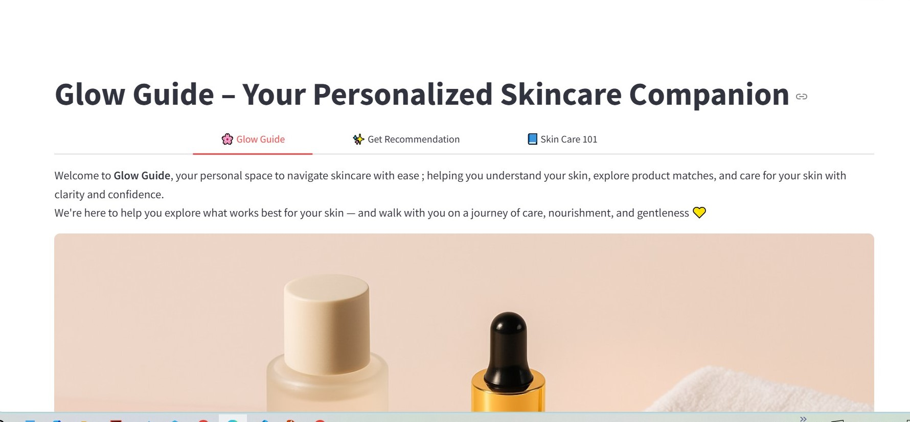
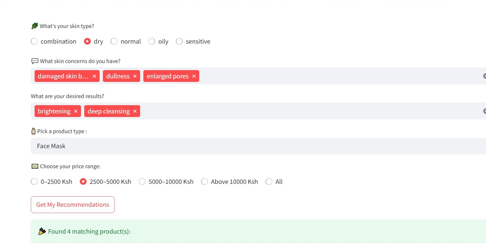
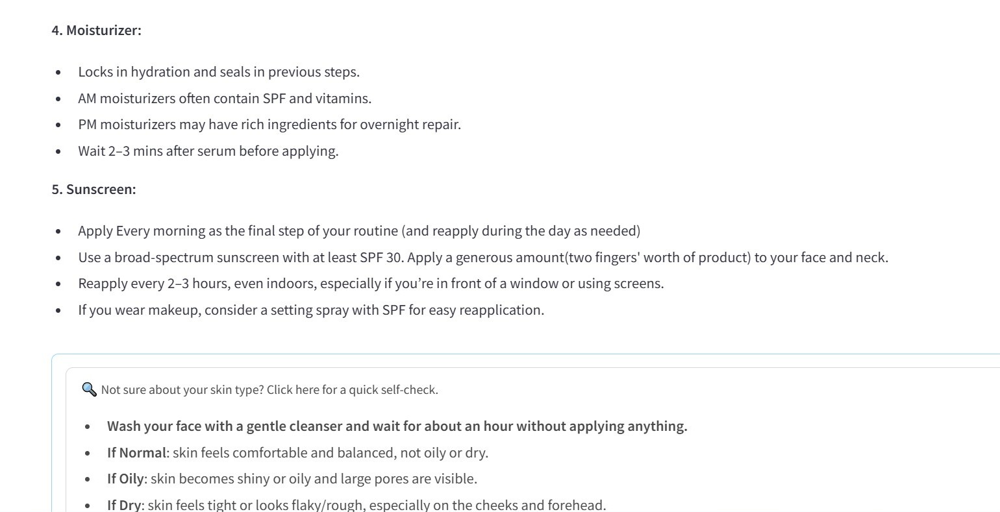

In an age where skincare is vast and popular, many individuals feel overwhelmed by the multitude of products available. With numerous companies entering the market, it can be confusing to identify what works best for their unique skin types. As a result, people often rely on influencers, follow trends, or choose products based on price rather than compatibility.

To address this challenge, I developed a streamlined skincare recommender app ** Glow Guide**, that provides personalized suggestions based on individual skin types and concerns. By simplifying the product discovery process, the app empowers users to make informed choices for healthier skin. With its intuitive interface, this app is designed to guide both skincare beginners and enthusiasts in finding the right products for their unique needs.

Features

Tab 1: Glow Guide (Home Page)
Introduces users to the purpose and philosophy of the app.
Includes a calming aesthetic image to set a relaxing tone.
Encourages professional consultation for deeper skincare issues. 

Tab 2: Get Recommendation![]
Allows users to select:
Skin type (e.g., dry, oily, combination, sensitive, normal), Skin concerns (e.g., hyperpigmentation, acne, fine lines), Desired outcomes (e.g., hydration, brightening, anti-aging), Product type (e.g., serum, moisturizer, cleanser) and price range.
It also:
-Matches user input to relevant skincare products from the dataset.
-Displays recommended products in a clean, scrollable table.
-Includes a download button to export recommendations as a CSV file.

Tab 3: Skin Care 101
Educates users on how to use each product effectively.
Includes guidance for AM/PM routines and layering techniques.
Offers tips on developing consistent skincare habits.
Contains a skin type self-check guide for users unsure of their type.

Glow Guide isn’t just a tool — it’s your personal skincare companion that makes your journey simpler and more personalised. Thank you for exploring Glow guide — because your skin deserves care as unique as you are🌸.
